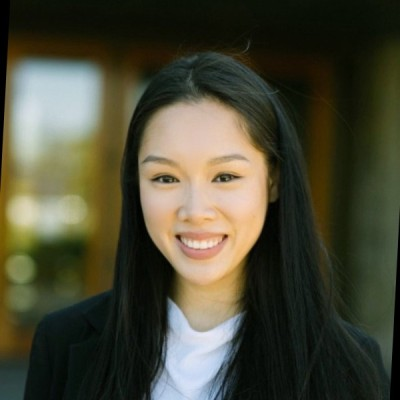

Hi my name is Cindy, 

I am an MSc Business Analytics candidate at the Ivey School of Business, who wants to leverage my leadership and analytical skills to make a positive impact through my work and inspire those around me to do the same. As businesses become increasingly technologically dependent and consumers become increasingly socially aware, I want to play a role in helping organizations do good by doing good.

Outside of school and work, I enjoy hiking, travelling, dancing and reading biographies/personal finance books. 

My favourite quote is: “Fight for things that you care about, but do it in a way that will lead others to join you.” - Ruth Bader Ginsburg

My favourite book is: Outliers by Malcolm Gladwell

My favourite food is: Homemade Vietnamese food 

### My story

I was born and raised in Canada and grew up as an extremely shy and soft-spoken kid. This may had to do with the fact that my parents were young parents who just arrived in Canada so I did not speak any English when I started school. From a young age I was passionate about helping others, whether that be staying in at recess to help my peers who were struggling with math in middle school or going on a solo mission trip in high school. Although I was a very soft-spoken kid, I always pushed myself outside of my comfort zone because I felt that those were the times where I grew and learned the most. Because of this, I always pushed myself to be involved in school and work in service-oriented roles where I had to constantly interact with people. These experienes helped me develop as a communicator, but also helped solidy my learning-mindset as I realized that there is so much I can learn from every single person that I meet.

As someone who is passionate about making a positive impact through my work and helping others, I initially pursued a career in science. I graduated with my BSc in Medical sciences in 2018 and accepted my dental school admission, which was the goal at the time. I knew that being a dentist would give me a comfortable life but when I began to think about my future, I quickly came to realize that comfortable was not what I wanted. I wanted to pursue a career that is challenging, fast paced, and something where I am constantly learning and growing because that is what drives me. 

So I turned down the offers and began to push myself outside of my comfort zone to find what it was that I was that I passionate about. I became an operations associate at CHUBB and this was a pivotal experience for me, because it showed me how my experiences were transferrable to a business environment and how I could make an impact while pursuing a career in business. I joined the CARE committee at CHUBB, lead a local volunteer initiative and helped organize in our United Way Campaign. 

Although I enjoyed my experience at Chubb, I knew that I wanted to become a more well rounded employee and make a bigger impact at the organization that I was working at. So I decided to go back to school for my MSc in Business Analytics, so that I could further develop my bussiness accumen and soft skills while also building my technical skillset. To date, my favourite courses have been Finance and Simulation and Risk Analysis.
